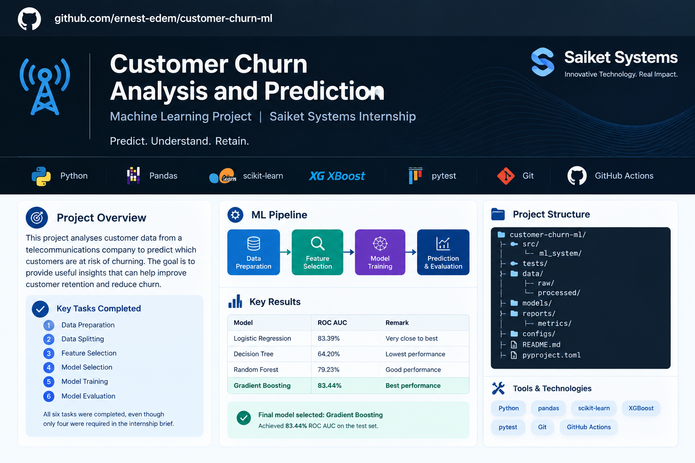

# Customer Churn Analysis and Prediction

[](https://github.com/ernest-edem/customer-churn-ml/actions/workflows/tests.yml)



A configuration driven machine learning system for customer churn analysis and prediction, developed as part of the **Saiket Systems Machine Learning Internship**.

The project combines a modular machine learning workflow with a **FastAPI prediction API** and a **React frontend**. The ML workflow covers data preparation, data splitting, preprocessing, feature selection, model selection, model training, evaluation, cross validation, persistence, reporting, and automated testing.

## 1. Project Overview

Customer churn occurs when customers discontinue their relationship with a company or service provider. Predicting potential churn can help organizations identify customers who may leave and support data driven retention strategies.

This project develops a reusable machine learning system that predicts customer churn while keeping the machine learning framework separate from the specific customer churn problem.

The system is **configuration driven**, meaning important settings such as the dataset path, target column, train test split, preprocessing strategies, feature selection method, model, model parameters, and evaluation metrics are controlled through configuration rather than hardcoded throughout the application.

The project also provides a web application for submitting customer information and viewing the resulting prediction and model performance information.

### Core Principles

> **Separate the ML framework from the ML problem.**

> **As simple as possible, as structured as necessary.**

## 2. Application

The current application uses React for the user interface and FastAPI for prediction requests.

The main user flow is:

```text
Landing Page
     ↓
Customer Assessment
     ↓
Prediction Results
     ↓
Model Performance
```

The frontend is located in:

```text
frontend/
```

The FastAPI backend is located in:

```text
backend/
```

The prediction service loads the persisted machine learning pipeline from:

```text
models/model.joblib
```

### Frontend

The React application provides:

* Customer assessment form
* Step by step form navigation
* Client side validation
* Prediction submission
* Loading and error states
* Churn prediction result
* Churn probability visualization
* Model performance information
* Responsive layouts
* Accessibility focused form and navigation elements

### Backend

The FastAPI application provides:

* `GET /health` for API health checks
* `POST /predict` for customer churn predictions
* Request validation through Pydantic schemas
* CORS configuration for the local React development server
* Prediction using the persisted ML pipeline

The API is defined in:

```text
backend/app/main.py
```

## 3. Internship Requirements

The project implements all six major tasks specified for the internship:

1. Data Preparation
2. Data Splitting
3. Feature Selection
4. Model Selection
5. Model Training
6. Model Evaluation

Additional supporting capabilities were implemented to make the workflow reproducible and maintainable:

* Configuration management
* Dataset validation
* Dataset profiling
* Automated preprocessing
* Cross validation
* Model persistence
* Metrics reporting
* Structured logging
* Automated testing
* FastAPI prediction service
* React frontend

## 4. Objectives

The main objectives are to:

* Prepare the customer churn dataset for machine learning.
* Separate training and testing data correctly.
* Automatically preprocess numerical and categorical features.
* Apply configurable feature selection.
* Compare multiple classification algorithms.
* Validate model performance using cross validation.
* Train the selected model.
* Evaluate model performance using appropriate classification metrics.
* Persist the trained model for later use.
* Generate machine readable evaluation reports.
* Provide a reusable prediction API.
* Provide a practical web interface for customer assessments.
* Maintain a modular and reusable ML architecture.
* Validate the system through automated tests.

## 5. Dataset

The project uses a customer churn dataset containing information about customer demographics, services, contracts, billing, and churn status.

### Original Dataset

* Rows: **7,043**
* Columns: **21**
* Target: `Churn`
* Identifier: `customerID`
* Numerical and categorical features are included.

The `TotalCharges` column was originally represented as a string and was converted to a numeric data type during dataset preparation.

The `customerID` identifier was removed because it does not provide meaningful predictive information.

After preparation:

* Rows: **7,032**
* Columns: **20**
* Missing values: **0**
* Duplicate rows: **0**
* Target classes:

  * `No`: 5,163
  * `Yes`: 1,869

Eleven records with invalid or blank `TotalCharges` values were removed during dataset preparation.

## 6. System Architecture

The machine learning workflow follows a modular architecture:

```text
                     Configuration
                          │
                          ▼
                  Configuration Loader
                          │
                          ▼
                     Data Loading
                          │
                          ▼
                    Data Validation
                          │
                          ▼
                     Data Splitting
                          │
                 ┌────────┴────────┐
                 ▼                 ▼
            Training Data     Testing Data
                 │
                 ▼
             Preprocessing
                 │
                 ▼
           Feature Selection
                 │
                 ▼
              Model Factory
                 │
                 ▼
            Model Training
                 │
                 ▼
           Model Evaluation ◄──── Testing Data
                 │
          ┌──────┴───────┐
          ▼              ▼
      Model Store    Metrics Reports
```

The application layer extends the ML workflow:

```text
React Frontend
      │
      │ POST /predict
      ▼
FastAPI Backend
      │
      ▼
Persisted ML Pipeline
      │
      ▼
Customer Churn Prediction
```

The main training workflow is orchestrated by:

```text
src/ml_system/pipeline.py
```

Model benchmarking and cross validation are implemented in:

```text
src/ml_system/benchmark.py
```

The API entry point is:

```text
backend/app/main.py
```

## 7. Project Structure

```text
customer-churn-ml/
│
├── backend/
│   └── app/
│       ├── main.py
│       ├── schemas.py
│       └── services/
│           └── prediction.py
│
├── config/
│   ├── config.yaml
│   └── logging.yaml
│
├── data/
│   └── processed/
│       └── customer_churn_processed.csv
│
├── docs/
│   └── images/
│       └── customer-churn-github-preview.png
│
├── frontend/
│   ├── public/
│   │   └── favicon.svg
│   └── src/
│       ├── components/
│       │   └── CustomerAssessmentForm.jsx
│       ├── pages/
│       │   ├── AssessmentPage.jsx
│       │   ├── LandingPage.jsx
│       │   ├── ModelPage.jsx
│       │   └── ResultsPage.jsx
│       ├── services/
│       │   └── predictionService.js
│       ├── App.jsx
│       ├── index.css
│       └── main.jsx
│
├── models/
│   └── model.joblib
│
├── reports/
│   ├── figures/
│   └── metrics/
│       ├── model_benchmark.csv
│       ├── cross_validation.csv
│       └── production_metrics.json
│
├── src/
│   └── ml_system/
│       ├── config/
│       │   ├── loader.py
│       │   └── schemas.py
│       │
│       ├── data/
│       │   ├── loader.py
│       │   ├── validator.py
│       │   ├── profiler.py
│       │   ├── splitter.py
│       │   └── dataset/
│       │       ├── Churn_Dataset.csv
│       │       └── prepare_dataset.py
│       │
│       ├── preprocessing/
│       │   └── pipeline.py
│       │
│       ├── features/
│       │   └── selector.py
│       │
│       ├── models/
│       │   └── factory.py
│       │
│       ├── training/
│       │   └── trainer.py
│       │
│       ├── evaluation/
│       │   └── evaluator.py
│       │
│       ├── persistence/
│       │   └── model_store.py
│       │
│       ├── reporting/
│       │   ├── __init__.py
│       │   └── report_generator.py
│       │
│       ├── benchmark.py
│       └── pipeline.py
│
├── tests/
│   ├── test_api.py
│   ├── test_benchmark.py
│   ├── test_config.py
│   ├── test_data.py
│   ├── test_data_profiler.py
│   ├── test_data_splitter.py
│   ├── test_data_validation.py
│   ├── test_edge_cases.py
│   ├── test_evaluation.py
│   ├── test_feature_selection.py
│   ├── test_logging.py
│   ├── test_model_factory.py
│   ├── test_persistence.py
│   ├── test_pipeline.py
│   ├── test_preprocessing.py
│   ├── test_reporting.py
│   └── test_training.py
│
├── .github/
│   └── workflows/
│       └── tests.yml
│
├── .gitignore
├── CITATION.cff
├── CONTRIBUTING.md
├── LICENSE
├── pyproject.toml
├── requirements.txt
└── README.md
```

The repository no longer contains the obsolete Streamlit application.

## 8. Data Preparation

Dataset preparation is implemented in:

```text
src/ml_system/data/dataset/prepare_dataset.py
```

The preparation process:

1. Loads the raw CSV dataset.
2. Removes the `customerID` identifier.
3. Converts `TotalCharges` to numeric values.
4. Identifies invalid `TotalCharges` values.
5. Removes records where `TotalCharges` cannot be converted.
6. Saves the processed dataset.

The processed dataset is saved to:

```text
data/processed/customer_churn_processed.csv
```

The preparation step produces a clean dataset suitable for the ML pipeline.

## 9. Data Validation and Profiling

Dataset validation is implemented in:

```text
src/ml_system/data/validator.py
```

The validator checks:

* Dataset type
* Empty datasets
* Presence of required columns
* Target column existence
* Valid target observations

Dataset profiling is implemented in:

```text
src/ml_system/data/profiler.py
```

The profiler provides information about:

* Dataset dimensions
* Column names
* Data types
* Missing values
* Duplicate rows
* Numerical columns
* Categorical columns
* Target distribution

## 10. Data Splitting

Data splitting is implemented in:

```text
src/ml_system/data/splitter.py
```

The default configuration uses:

```yaml
split:
  test_size: 0.20
  random_state: 42
  stratify: true
```

Therefore:

* **80%** of the data is used for training.
* **20%** is used for testing.
* `random_state=42` provides reproducibility.
* Stratification preserves the target class distribution between training and testing data.

The test set remains isolated from model fitting and cross validation.

## 11. Preprocessing

Preprocessing is implemented in:

```text
src/ml_system/preprocessing/pipeline.py
```

The system dynamically identifies numerical and categorical features.

### Numerical Features

The configured numerical preprocessing uses:

* Median imputation
* Standard scaling

### Categorical Features

The configured categorical preprocessing uses:

* Most frequent value imputation
* One hot encoding
* `handle_unknown="ignore"`

The preprocessing uses scikit learn:

* `Pipeline`
* `ColumnTransformer`
* `SimpleImputer`
* `StandardScaler`
* `OneHotEncoder`

Preprocessing operations are learned from the training data as part of the machine learning pipeline.

## 12. Feature Selection

Feature selection is implemented in:

```text
src/ml_system/features/selector.py
```

The current configuration uses:

```yaml
features:
  selection:
    enabled: true
    method: mutual_information
    top_k: 10
```

The system uses mutual information to select the top 10 transformed features.

Feature selection can be disabled or modified through configuration without changing the core training workflow.

## 13. Model Selection

Four classification models were implemented and benchmarked:

1. Logistic Regression
2. Decision Tree
3. Random Forest
4. Gradient Boosting

The model factory is implemented in:

```text
src/ml_system/models/factory.py
```

Supported models are registered centrally and created from configuration.

## 14. Holdout Model Benchmark

The four models were evaluated using the same stratified train test split and evaluation criteria.

### Holdout Benchmark Results

| Model               | Accuracy | Precision | Recall |     F1 |    ROC AUC |
| ------------------- | -------: | --------: | -----: | -----: | ---------: |
| Gradient Boosting   |   78.75% |    77.81% | 78.75% | 78.11% | **83.44%** |
| Logistic Regression |   78.82% |    78.06% | 78.82% | 78.33% |     83.39% |
| Random Forest       |   77.33% |    76.24% | 77.33% | 76.59% |     79.23% |
| Decision Tree       |   71.29% |    71.63% | 71.29% | 71.45% |     64.20% |

Logistic Regression achieved slightly higher accuracy, precision, recall, and F1 score than Gradient Boosting on the holdout set.

Gradient Boosting achieved the highest ROC AUC at **83.44%**.

ROC AUC was the primary criterion used for selecting the production model. Based on the documented benchmark, Gradient Boosting was selected.

The benchmark results are persisted to:

```text
reports/metrics/model_benchmark.csv
```

## 15. Cross Validation

To provide an additional estimate of model performance, the training portion of the dataset is evaluated using **5 fold stratified cross validation**.

The test set remains isolated and is not included in cross validation.

Cross validation is implemented in:

```text
src/ml_system/benchmark.py
```

The evaluation uses:

```text
StratifiedKFold

n_splits = 5

shuffle = true

random_state = 42
```

Preprocessing and feature selection remain inside the scikit learn pipeline during each fold, helping prevent information leakage between training and validation folds.

### 5 Fold Cross Validation Results

| Model               | Accuracy Mean | Accuracy Std | Precision Mean | Precision Std | Recall Mean | Recall Std |    F1 Mean | F1 Std | ROC AUC Mean | ROC AUC Std |
| ------------------- | ------------: | -----------: | -------------: | ------------: | ----------: | ---------: | ---------: | -----: | -----------: | ----------: |
| Gradient Boosting   |    **79.96%** |        0.61% |     **79.00%** |         0.72% |  **79.96%** |      0.61% |     79.16% |  0.70% |   **84.48%** |       0.61% |
| Logistic Regression |        79.66% |        0.60% |         78.89% |         0.67% |      79.66% |      0.60% | **79.12%** |  0.65% |       84.30% |       0.52% |
| Random Forest       |        77.81% |        0.61% |         76.73% |         0.60% |      77.81% |      0.61% |     77.05% |  0.58% |       81.28% |       0.50% |
| Decision Tree       |        73.55% |        1.12% |         73.68% |         0.94% |      73.55% |      1.12% |     73.61% |  1.02% |       66.83% |       1.28% |

Gradient Boosting achieved a mean ROC AUC of:

```text
0.844769 ± 0.006141
```

Logistic Regression achieved:

```text
0.843022 ± 0.005229
```

The standard deviations provide an indication of variation across the five folds.

Cross validation is used as an evaluation and model selection aid. It does not replace the isolated holdout test evaluation.

The results are persisted to:

```text
reports/metrics/cross_validation.csv
```

## 16. Final Model

The production configuration uses:

```yaml
model:
  name: gradient_boosting
  parameters:
    n_estimators: 100
    learning_rate: 0.1
    max_depth: 3
    random_state: 42
```

The final estimator is:

```text
GradientBoostingClassifier
```

The persisted model is stored at:

```text
models/model.joblib
```

## 17. Final Model Performance

The final Gradient Boosting model achieved the following holdout performance:

| Metric    |     Result |
| --------- | ---------: |
| Accuracy  | **78.75%** |
| Precision | **77.81%** |
| Recall    | **78.75%** |
| F1 score  | **78.11%** |
| ROC AUC   | **83.44%** |

### Cross Validation Performance

The corresponding 5 fold cross validation results were:

| Metric    |       Mean | Standard Deviation |
| --------- | ---------: | -----------------: |
| Accuracy  | **79.96%** |              0.61% |
| Precision | **79.00%** |              0.72% |
| Recall    | **79.96%** |              0.61% |
| F1 score  | **79.16%** |              0.70% |
| ROC AUC   | **84.48%** |              0.61% |

### Confusion Matrix

The holdout confusion matrix is:

```text
                Predicted
                 No     Yes

Actual No        914    119
Actual Yes       180    194
```

The model correctly identified:

* 914 non churn customers
* 194 churn customers

It incorrectly classified:

* 119 non churn customers as churn
* 180 churn customers as non churn

The holdout results show that the model does not identify all actual churn customers. This limitation is discussed further in the limitations section.

## 18. Model Training

Model training is implemented in:

```text
src/ml_system/training/trainer.py
```

The training workflow combines:

```text
Preprocessing
      ↓
Feature Selection
      ↓
Model
```

into a single scikit learn `Pipeline`.

This keeps the transformations and trained estimator together and allows the complete pipeline to be persisted.

## 19. Model Evaluation

Evaluation is implemented in:

```text
src/ml_system/evaluation/evaluator.py
```

The system supports:

* Accuracy
* Precision
* Recall
* F1 score
* ROC AUC
* Confusion matrix
* Classification report

Metrics are configured through:

```yaml
evaluation:
  metrics:
    - accuracy
    - precision
    - recall
    - f1
    - roc_auc
```

## 20. Model Persistence

Model persistence is implemented in:

```text
src/ml_system/persistence/model_store.py
```

The trained pipeline can be saved and loaded using `joblib`.

The configured model location is:

```text
models/model.joblib
```

Generated model artifacts are excluded from version control through `.gitignore`.

## 21. Reporting

Reporting functionality is implemented in:

```text
src/ml_system/reporting/report_generator.py
```

The reporting module supports:

* JSON evaluation reports
* CSV model benchmark reports
* CSV cross validation reports

Generated reports include:

```text
reports/metrics/production_metrics.json
reports/metrics/model_benchmark.csv
reports/metrics/cross_validation.csv
```

The reporting functions are covered by automated tests.

## 22. Configuration

The system is controlled through:

```text
config/config.yaml
```

Important configurable components include:

* Dataset path
* Target column
* Task type
* Test size
* Random state
* Stratification
* Missing value strategy
* Categorical encoding
* Numerical scaling
* Feature selection method
* Number of selected features
* Model
* Model parameters
* Evaluation metrics
* Model persistence path

For example:

```yaml
data:
  path: data/processed/customer_churn_processed.csv
  target_column: Churn
task:
  type: classification
```

This design minimizes hardcoded problem specific assumptions.

## 23. Logging

Structured application logging is configured through:

```text
config/logging.yaml
```

The system uses Python's `logging` framework with:

* Console logging
* Rotating file logging
* Configurable log levels
* Structured log formatting

Application logs are excluded from version control.

## 24. Prediction API

The FastAPI application is implemented in:

```text
backend/app/main.py
```

### Health Endpoint

```http
GET /health
```

Example response:

```json
{
  "status": "ok"
}
```

### Prediction Endpoint

```http
POST /predict
```

The endpoint accepts a validated customer assessment and returns a churn prediction and probability.

Example response:

```json
{
  "prediction": "Yes",
  "churn_probability": 0.7354953070025138
}
```

The prediction is generated from the persisted machine learning pipeline. The probability is model derived and is not hardcoded.

### API Documentation

When the backend is running, FastAPI provides interactive documentation at:

```text
http://127.0.0.1:8000/docs
```

## 25. React Frontend

The frontend is implemented using:

```text
React
Vite
Tailwind CSS
React Router
Recharts
Lucide React
```

The application entry point is:

```text
frontend/src/main.jsx
```

Application routing is handled in:

```text
frontend/src/App.jsx
```

The current routes are:

```text
/            Landing page
/assessment  Customer assessment
/results     Prediction results
/model       Model performance
```

The frontend prediction service is:

```text
frontend/src/services/predictionService.js
```

By default, the frontend connects to:

```text
http://127.0.0.1:8000
```

The API URL can be configured with:

```text
VITE_API_URL
```

## 26. Testing

The project includes automated tests covering the major system components.

The test suite covers:

* Configuration loading
* Logging
* Dataset loading
* Dataset validation
* Dataset profiling
* Dataset splitting
* Preprocessing
* Feature selection
* Model factory
* Model training
* Evaluation
* Persistence
* Pipeline integration
* Benchmarking
* Cross validation
* Reporting
* API endpoints
* Edge cases

The current verified test suite contains:

```text
129 tests
```

Latest full test result:

```text
129 passed, 1 warning
```

The warning is an existing Starlette and AnyIO deprecation warning and does not represent a failed test.

Run the backend and ML test suite with:

```powershell
python -m pytest -q
```

The frontend has separate lint and production build checks:

```powershell
cd frontend

npm run lint

npm run build
```

The current frontend validation completed successfully with no ESLint errors or warnings, and the Vite production build completed successfully.

## 27. Installation

### Requirements

* Python 3.11+
* Node.js
* npm
* Git

### Clone the Repository

```powershell
git clone https://github.com/ernest-edem/customer-churn-ml.git
cd customer-churn-ml
```

### Create a Python Virtual Environment

Windows PowerShell:

```powershell
python -m venv .venv
```

### Activate the Environment

```powershell
.venv\Scripts\Activate.ps1
```

### Install Python Dependencies

```powershell
python -m pip install -r requirements.txt
```

### Install the Project

```powershell
python -m pip install -e .
```

### Install Frontend Dependencies

```powershell
cd frontend
npm install
cd ..
```

## 28. Prepare the Dataset

Run:

```powershell
python src/ml_system/data/dataset/prepare_dataset.py
```

This creates:

```text
data/processed/customer_churn_processed.csv
```

## 29. Run the Machine Learning Pipeline

The complete training workflow performs:

```text
Load configuration
        ↓
Load dataset
        ↓
Validate dataset
        ↓
Split dataset
        ↓
Build preprocessing pipeline
        ↓
Select features
        ↓
Build model
        ↓
Train model
        ↓
Evaluate model
        ↓
Save model
        ↓
Save metrics
```

The main pipeline is implemented in:

```text
src/ml_system/pipeline.py
```

## 30. Run the Model Benchmark and Cross Validation

From the project root:

```powershell
python -m ml_system.benchmark
```

The benchmark evaluates:

```text
Logistic Regression
Decision Tree
Random Forest
Gradient Boosting
```

Results are persisted to:

```text
reports/metrics/model_benchmark.csv
reports/metrics/cross_validation.csv
```

## 31. Run the FastAPI Backend

From the project root:

```powershell
python -m uvicorn backend.app.main:app --reload
```

The API will be available at:

```text
http://127.0.0.1:8000
```

Health check:

```text
http://127.0.0.1:8000/health
```

Interactive API documentation:

```text
http://127.0.0.1:8000/docs
```

## 32. Run the React Frontend

Open a second PowerShell terminal.

From the project root:

```powershell
cd frontend
npm run dev
```

Vite normally serves the application at:

```text
http://localhost:5173
```

The frontend expects the FastAPI backend to be running on:

```text
http://127.0.0.1:8000
```

### Frontend Validation Commands

Lint:

```powershell
npm run lint
```

Production build:

```powershell
npm run build
```

Preview the production build:

```powershell
npm run preview
```

## 33. Run the Complete Application

The frontend and backend should be started separately during local development.

### Terminal 1: FastAPI

From:

```text
D:\projects\customer-churn-ml
```

run:

```powershell
.venv\Scripts\Activate.ps1
python -m uvicorn backend.app.main:app --reload
```

### Terminal 2: React

From:

```text
D:\projects\customer-churn-ml\frontend
```

run:

```powershell
npm run dev
```

Then open the Vite application in a browser.

The application flow is:

```text
React Frontend
      ↓
Customer Assessment
      ↓
POST /predict
      ↓
FastAPI
      ↓
models/model.joblib
      ↓
Prediction Response
      ↓
Results Page
```

## 34. Reproducibility

Reproducibility is supported through configuration controlled random states.

The current project uses:

```text
random_state = 42
```

for data splitting, cross validation, and applicable models.

The preprocessing, feature selection, model training, and evaluation steps are assembled into consistent scikit learn pipelines.

Cross validation uses:

```text
StratifiedKFold

n_splits = 5

shuffle = true

random_state = 42
```

This provides a reproducible evaluation procedure while preserving the class distribution across folds.

## 35. Continuous Integration

The project uses GitHub Actions for automated Python testing.

The workflow is:

```text
.github/workflows/tests.yml
```

The workflow:

1. Checks out the repository.
2. Sets up Python 3.11.
3. Installs the Python dependencies.
4. Installs the project.
5. Runs the test suite.

The workflow runs on pushes and pull requests targeting the `master` branch.

Frontend linting and production builds are currently verified locally and are separate from the Python test workflow.

## 36. Limitations

The current system has several limitations.

### Class Imbalance

The churn dataset contains substantially more non churn customers than churn customers. Model performance should therefore be interpreted using multiple metrics rather than accuracy alone.

### Churn Recall

The final model achieved approximately **52% recall for the churn class** on the holdout evaluation. A significant proportion of actual churn customers were therefore classified as non churn.

### Binary Classification

The current evaluation workflow is designed for binary classification, particularly for ROC AUC evaluation.

### Dataset Scope

The model's performance depends on the characteristics and quality of the available dataset. Results may not generalize to different customer populations without additional validation.

### No External Validation

The current evaluation uses the available dataset and an isolated holdout test set. External validation on an independent customer population has not been performed.

### Local Application Configuration

The current React frontend and FastAPI backend are configured primarily for local development. Production hosting, domain configuration, secrets management, and infrastructure deployment are outside the current scope.

## 37. Future Improvements

Potential future improvements include:

* Hyperparameter optimization
* Class imbalance handling
* Threshold optimization
* Additional model evaluation
* ROC and Precision Recall curve generation
* Explainability using SHAP or similar methods
* Model monitoring
* External validation on an independent dataset
* Production deployment of the React frontend and FastAPI API
* Frontend and backend CI validation
* Containerized application deployment

These improvements are outside the current internship implementation and can be considered as future development work.

## 38. Conclusion

This project implements a complete and reusable machine learning workflow for customer churn analysis and prediction.

All six internship tasks were completed:

```text
✓ Data Preparation

✓ Data Splitting

✓ Feature Selection

✓ Model Selection

✓ Model Training

✓ Model Evaluation
```

Four classification models were benchmarked, with Gradient Boosting selected as the production model based primarily on ROC AUC performance.

The final holdout evaluation achieved:

```text
Accuracy:  78.75%

F1 score:  78.11%

ROC AUC:   83.44%
```

The 5 fold stratified cross validation evaluation achieved:

```text
Accuracy:  79.96% ± 0.61%

F1 score:  79.16% ± 0.70%

ROC AUC:   84.48% ± 0.61%
```

The project also demonstrates practical software engineering principles through:

* Modular architecture
* Configuration driven execution
* Automated testing
* Structured logging
* Model persistence
* Reproducible evaluation
* Machine readable reporting
* REST API development
* React frontend development
* Responsive and accessible interface design
* Continuous integration

The current repository therefore provides both the underlying machine learning workflow and a practical web interface for interacting with the trained model.

## 39. Technologies Used

### Machine Learning

* Python 3.11
* Pandas
* NumPy
* Scikit learn
* PyYAML
* Joblib

### Backend

* FastAPI
* Uvicorn
* Pydantic
* HTTPX

### Frontend

* React 19
* Vite 8
* Tailwind CSS 4
* React Router
* Recharts
* Lucide React
* ESLint

### Testing and Development

* Pytest
* Git
* GitHub
* GitHub Actions

## 40. Project Status

**Status: Completed internship implementation with an active full stack application layer.**

The implementation satisfies the defined Machine Learning Project Contract v1.0 and the six core internship tasks.

### Test Status

```text
129 passed
```

### Production Model

```text
GradientBoostingClassifier
```

### Holdout ROC AUC

```text
83.44%
```

### 5 Fold Cross Validation ROC AUC

```text
84.48% ± 0.61%
```

### Application Stack

```text
React
    ↓
FastAPI
    ↓
Persisted Gradient Boosting Pipeline
```

### Generated Evaluation Reports

```text
reports/metrics/production_metrics.json
reports/metrics/model_benchmark.csv
reports/metrics/cross_validation.csv
```

## About the Author

**Ernest Edem Dzisah** is a Computer Science and Engineering student focused on Software Engineering and Artificial Intelligence and Machine Learning (AI/ML).

His technical interests include machine learning, data science, Python development, and building practical software systems that combine data, automation, and intelligent decision making.

## Research Interests

His research interests include:

* Machine Learning and Artificial Intelligence
* Explainable and Interpretable Machine Learning
* Applied Machine Learning for Healthcare
* Predictive Modeling
* Natural Language Processing
* Computer Vision
* Responsible and Trustworthy AI
* Machine Learning Systems and MLOps
* Data Science and Applied Statistics
* AI driven Software Engineering

He is interested in research opportunities that connect machine learning with practical problems and can lead to reproducible, useful, and deployable solutions.

## Contacts

* **Email:** `ernestedem.d@gmail.com`
* **GitHub:** [ernest-edem](https://github.com/ernest-edem)
* **LinkedIn:** [Ernest Edem Dzisah](https://www.linkedin.com/in/ernest-edem-dzisah)

For research collaborations, software engineering opportunities, AI/ML projects, internships, or other professional opportunities, contact Ernest through the channels above.

This project was developed as part of his Saiket Systems Machine Learning Internship and demonstrates practical experience with:

* Python and scikit learn
* Data preprocessing and feature engineering
* Supervised machine learning
* Feature selection
* Model benchmarking and evaluation
* Cross validation
* Configuration driven software design
* Automated testing with pytest
* FastAPI API development
* React frontend development
* Continuous integration with GitHub Actions

## License

This project was developed for educational and internship purposes as part of the Saiket Systems Machine Learning Internship.
